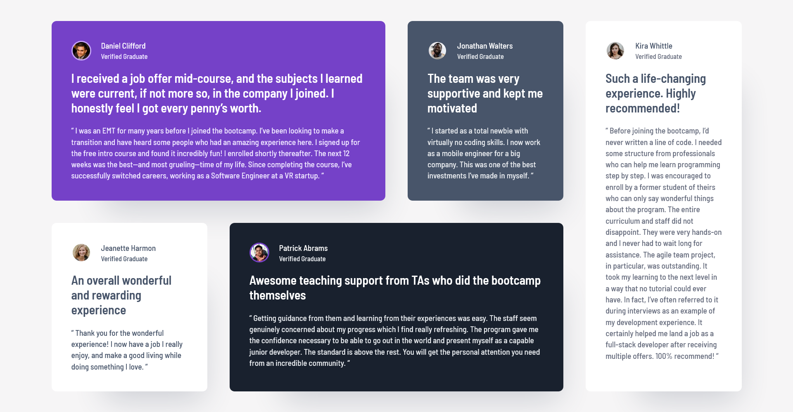

# Frontend Mentor - Testimonials grid section solution

This is a solution to the [Testimonials grid section challenge on Frontend Mentor](https://www.frontendmentor.io/challenges/testimonials-grid-section-Nnw6J7Un7). Frontend Mentor challenges help you improve your coding skills by building realistic projects.

## Table of contents

- [Overview](#overview)
  - [The challenge](#the-challenge)
  - [Screenshot](#screenshot)
  - [Links](#links)
- [My process](#my-process)
  - [Built with](#built-with)
  - [What I learned](#what-i-learned)
  - [Continued development](#continued-development)
  - [Useful resources](#useful-resources)
- [Author](#author)
- [Acknowledgments](#acknowledgments)

## Overview

### The challenge

Users should be able to:

- View the optimal layout for the site depending on their device's screen size

### Screenshot



### Links

- Solution URL: [https://github.com/tasosbeast/testimonials-grid-section](https://github.com/tasosbeast/testimonials-grid-section)
- Live Site URL: [https://testimonials-grid-section-component.netlify.app/](https://testimonials-grid-section-component.netlify.app/)

## My process

### Built with

- Semantic HTML5 markup
- CSS custom properties
- Flexbox
- CSS Grid
- Mobile-first workflow
- [React](https://reactjs.org/) - JS library
- [Tailwind CSS](https://tailwindcss.com/) - For styles

### What I learned

Working with CSS Grid in this project taught me how to create responsive, complex layouts with minimal code. Tailwind CSS made this implementation even easier with its utility classes.

```jsx
<div className="grid grid-cols-1 gap-9 md:grid-cols-2 xl:grid-cols-4">
  {cardData.map((card) => (
    <Card key={card.id} {...card} />
  ))}
</div>
```

The above snippet demonstrates how I used Tailwind's grid system to create a responsive layout that:

- Shows 1 column on mobile devices (grid-cols-1)
- Expands to 2 columns on medium screens (md:grid-cols-2)
- Finally displays 4 columns on extra-large screens (xl:grid-cols-4)
- Maintains consistent spacing with gap-9

For card placement, I used CSS Grid's spanning capabilities to make some testimonials take up more space:

```jsx
<div
  className={`rounded-lg p-32 shadow-[40px_60px_50px_-47px_rgba(72,85,106,0.24)] ${cardColors[className]} ${gridProperties[className]}`}
>
  {/* Card content */}
</div>
```

Where gridProperties defines different grid placements:

```jsx
const gridProperties = {
  card1: "col-span-2",
  card4: "col-span-2",
  // other cards use default span
};
```

This approach allowed me to create a visually interesting layout while maintaining responsiveness across different screen sizes.

Working with React for this project was also very insightful. I learned how to:

- Create reusable components with props
- Manage component state efficiently
- Map through data to generate multiple instances of a component
- Pass dynamic class names and styling based on props

### Continued development

In future projects, I plan to focus more on interactive web experiences that engage the viewer beyond static layouts. Some specific areas I want to explore include:

1. **Advanced React Interactions**: Implementing more complex state management using hooks like useReducer and useContext to create interactive UIs that respond to user input.

2. **Animated Transitions**: Building on what I've learned with CSS Grid and Tailwind, I want to add smooth animations when components mount, unmount, or change state using libraries like Framer Motion or React Spring.

3. **User Engagement Features**: Creating interactive elements like:

   - Expandable testimonial cards that reveal more content when clicked
   - Carousel/slider functionality for viewing multiple testimonials
   - Filter systems that allow users to sort testimonials by category or rating

4. **Accessibility Improvements**: Ensuring all interactive elements are fully accessible with proper ARIA attributes, keyboard navigation, and screen reader support.

5. **Data Fetching**: Moving beyond static data files to implement real-time data fetching from APIs to display dynamic testimonial content that could be updated without redeploying the site.

I believe these skills will help me create more engaging and dynamic web applications that not only look great but also provide meaningful interactions for users.

### Useful resources

- [Tailwind CSS Documentation](https://tailwindcss.com/docs) - The official Tailwind docs were invaluable for learning how to implement responsive designs efficiently. The examples and interactive playground helped me understand utility classes quickly.

- [CSS-Tricks: A Complete Guide to Grid](https://css-tricks.com/snippets/css/complete-guide-grid/) - This comprehensive guide helped me understand CSS Grid concepts thoroughly before implementing them with Tailwind.

- [React Official Documentation](https://reactjs.org/docs/getting-started.html) - The React docs were essential for understanding component composition and props, which were crucial for this project.

- [Frontend Mentor Community](https://www.frontendmentor.io/community) - Viewing others' solutions gave me inspiration and different perspectives on tackling similar layout challenges.

## Author

- Frontend Mentor - [@tasosbeast](https://www.frontendmentor.io/profile/tasosbeast)

## Acknowledgments

I'd like to express my gratitude to Frontend Mentor for creating such practical challenges that help developers improve their skills. Special thanks to the online web development community whose tutorials and articles have been invaluable resources during my learning journey.

I also want to acknowledge the Tailwind CSS and React communities for their excellent documentation and examples that made this project possible.

Lastly, I'm grateful to fellow developers who shared their solutions to this challenge, providing different perspectives and approaches that helped me refine my own implementation.
